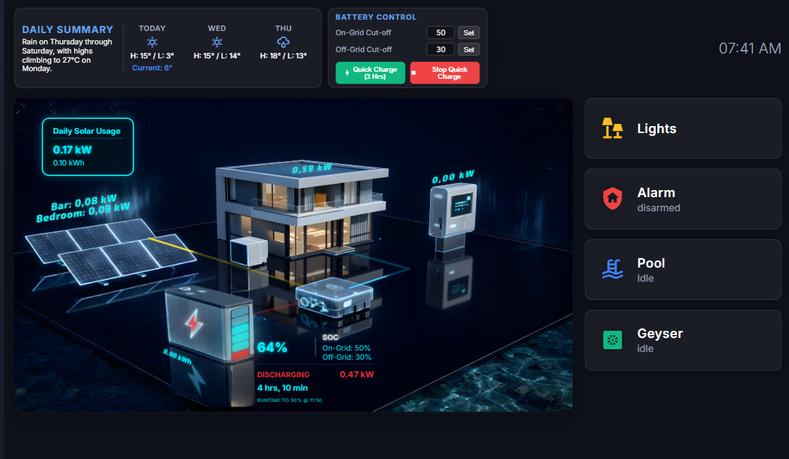

# Shelly XL Lumina Dashboard

> **Attribution:** This project's energy card design was forked from [Giorgio866/lumina-energy-card](https://github.com/Giorgio866/lumina-energy-card). We would like to thank the original author for their incredible work on the Lovelace card. This project modifies and adapts that work into a full, standalone HTML web dashboard specifically optimized for the Shelly Wall Display XL.

A standalone, high-performance web dashboard designed specifically for the Shelly Display XL, but compatible with any tablet or kiosk browser. This dashboard preserves absolute pixel positioning for a pixel-perfect isometric 3D energy visualization and quick access to Home Assistant entities.

## Shelly Wall Display & Android WebView Compatibility

This dashboard has been specifically engineered to overcome the limitations of the legacy Android Chromium WebView found on the Shelly Wall Display.

- **Network/mDNS Limitations**: Android WebView often fails to resolve `.local` addresses (like `homeassistant.local`). You **must** use the static IP address of your Home Assistant instance in `config.js` for the WebSocket connection.
- **Offline-First Architecture**: Designed for isolated IoT networks. All assets, including fonts (Inter, Exo 2, Orbitron) and libraries (GSAP), are hosted locally within the `/styles/fonts/` and `/scripts/` directories. This prevents the dashboard from hanging on networks without internet access.
- **Aggressive Caching**: Android WebViews cache assets heavily. When pushing updates, always use a cache-busting query string in your URL (e.g., `index.html?v=3`) to force the display to load the latest files.
- **UI Scaling & Flexbox**:
    - **Flexbox Fixes**: Applied `flex-shrink: 0;` to top-level widgets to prevent them from being crushed by Android's viewport calculation.
    - **Scaling**: The `scaleDashboard()` function uses `transform-origin: top left` and `document.documentElement.clientWidth` to ensure the 3D isometric view fits the 1280x696 usable space perfectly without clipping or off-screen rendering.

## Changelog / Recent Updates

### Added
- **Interactive Battery Control Panel**: A new glassmorphism panel next to the weather widget allowing direct control of On-Grid and Off-Grid discharge cut-off limits via numeric inputs.
- **WebSocket Write Logic**: Full integration for `set_value` and `press` services to control battery targets and trigger Quick Charge routines directly from the dashboard.
- **Solaris-Perspective Boilerplate**: Scaffolded a new root directory (`Solaris-Perspective`) to prepare for the deployment of a native Home Assistant Custom Lovelace card version.

### Changed
- **Weather Widget Typography**: Unified weather summary, day labels, and temperature text to a strictly enforced 12px layout via CSS, replacing legacy inline styles.
- **SOC Block Styling**: Enhanced visibility with a neon white header and dynamic color scaling for the primary SOC percentage (Green at 100%, Blue below 80%, Red below 40%).
- **Template Sensor Integration**: Replaced complex WebSocket queries with direct, synchronous attribute reads from `sensor.pirate_weather_daily_forecast` for lightning-fast loading.
- **Layout Density**: Tightly compressed the weather columns and battery control panels to ensure pixel-perfect fitting on the Shelly XL display without overflow.

### Removed
- **Legacy Forecast WebSocket**: Purged the deprecated `weather/get_forecasts` Promise pipeline.

### Fixed
- **Shelly Panel Scaling**: Implemented a master CSS scaling wrapper (`#dashboard-wrapper`) to dynamically fit the strict 1280x696 Shelly panel viewport without overlapping elements or relying on standard media queries that break absolute positioning.
- **Legacy WebView Compatibility**: Removed modern JavaScript syntax (like Optional Chaining `?.` and Nullish Coalescing `??`) and added robust `try/catch` error handling around the WebSocket connection to prevent silent WebView crashes on legacy Android panels.

## Features

- **Isometric 3D Energy Flow**: Real-time visualization of Solar, Battery, Grid, and Home Load.
- **Advanced Battery Stats**: Real-time calculation of remaining runtime and target SOC clock time.
- **Quick Access Tiles**: One-tap access to Lights, Alarms, Pool, and Geyser.
- **Dynamic Configuration**: Easily customize all entity IDs via a simple JavaScript file.
- **Tablet Optimized**: Includes auto-return to home screen after inactivity.
- **Glassmorphism UI**: Modern, sleek design with blurred backgrounds and vibrant icons.

## Workload & Architecture

This project operates completely differently from a standard Home Assistant Lovelace dashboard. It is a **Standalone Web Application** that connects directly to the Home Assistant WebSocket API to bypass the overhead of the standard HA frontend. 

1. **Initialization:** The browser loads `index.html` and injects your private `config.js`.
2. **Real-Time WebSocket Pipeline:** A direct WebSocket connection is established with `http://<YOUR_HA_IP>:8123/api/websocket` using your Long-Lived Access Token.
3. **Zero-Polling Updates:** Instead of polling the server, the app subscribes to `state_changed` events. When an inverter sensor updates, the WebSocket catches it instantly and updates the UI.
4. **Dynamic DOM Generation:** UI elements are generated entirely via JavaScript at runtime based on the parameters in your `config.js`.

### Visuals & Components

| Main Isometric View | 3D Battery Component |
| :---: | :---: |
|  |  |

*(Left: The raw pixel-perfect background that the live SVG flow paths animate over. Right: The custom 3D battery asset overlaid dynamically via the Lumina component.)*

## Manual Installation

To install the dashboard on your Home Assistant instance:

1. **Download the ZIP**: Download the latest release or clone this repository.
2. **Create Folder**: In your Home Assistant `/config/www/` directory, create a new folder named `ShellyDashboard`.
3. **Copy Files**: Copy all files from this project into the `/config/www/ShellyDashboard/` folder.
4. **Configure**: 
   - Duplicate `config.example.js` and rename it to `config.js`.
   - Open `config.js` and fill in your Home Assistant URL, Long-Lived Access Token, and entity IDs.
5. **Test**: Open your browser and navigate to:
   `http://<YOUR_HA_IP>:8123/local/ShellyDashboard/index.html`
6. **Shelly Setup**: In your Shelly Wall Display XL settings, set the "Custom Web UI" or "Home Page" URL to the address above.

## Setup & Configuration

1. **HA_URL**: Your Home Assistant IP/URL (e.g., `http://192.168.1.100:8123`).
2. **HA_TOKEN**: A Long-Lived Access Token (generated in your HA User Profile).
3. **ENTITIES**: Update the entity IDs to match your Home Assistant setup.
   - **ENERGY**: Map your inverter and battery sensors.
   - **BATTERY_CAPACITY_KWH**: Total capacity of your battery bank (default: 14kWh).
   - **SOC_ON_GRID_TARGET**: The target SOC when the grid is connected (e.g., 50%).
   - **SOC_OFF_GRID_TARGET**: The target SOC during loadshedding/outages (e.g., 30%).

## Privacy & Security

- **config.js**: This file contains your Access Token. It is ignored by Git to prevent accidental leaking of secrets. Never share this file.
- **ha_entities.json**: Used for development/offline mode. Also ignored by Git.

## License

MIT
