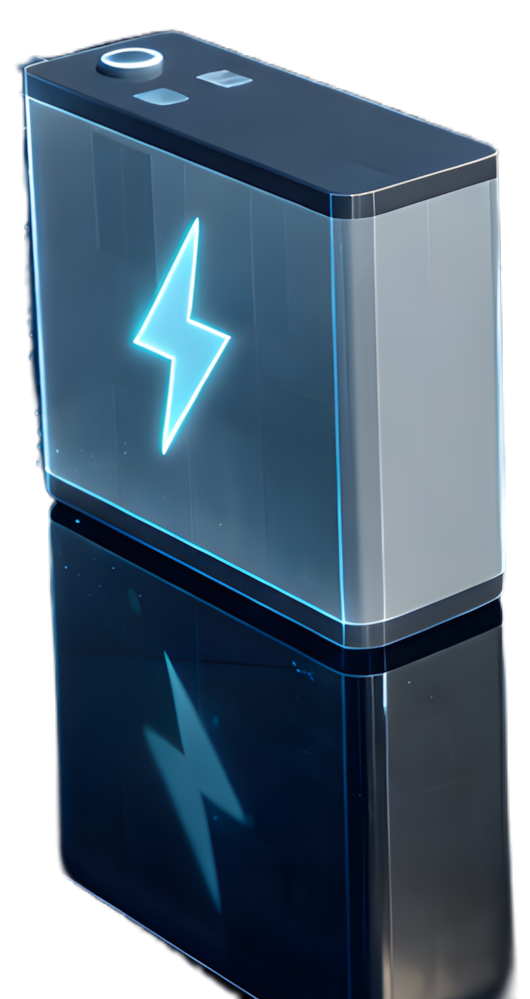

# Shelly XL Lumina Dashboard

A standalone, high-performance web dashboard designed specifically for the Shelly Display XL, but compatible with any tablet or kiosk browser. This dashboard preserves absolute pixel positioning for a pixel-perfect isometric 3D energy visualization and quick access to Home Assistant entities.

## Features

- **Isometric 3D Energy Flow**: Real-time visualization of Solar, Battery, Grid, and Home Load.
- **Quick Access Tiles**: One-tap access to Lights, Alarms, Pool, and Geyser.
- **Dynamic Configuration**: Easily customize all entity IDs via a simple JavaScript file.
- **Tablet Optimized**: Includes auto-return to home screen after inactivity.
- **Glassmorphism UI**: Modern, sleek design with blurred backgrounds and vibrant icons.

## Workload & Architecture

This project operates completely differently from a standard Home Assistant Lovelace dashboard. It is a **Standalone Web Application** that connects directly to the Home Assistant WebSocket API to bypass the overhead of the standard HA frontend. 

1. **Initialization:** The browser loads `index.html` and injects your private `config.js`.
2. **Real-Time WebSocket Pipeline:** A direct WebSocket connection is established with `http://<YOUR_HA_IP>:8123/api/websocket` using your Long-Lived Access Token.
3. **Zero-Polling Updates:** Instead of polling the server, the app subscribes to `state_changed` events. When an inverter sensor updates (e.g., Solar power jumps from 200W to 2500W), the WebSocket catches it instantly and injects a new object reference into the UI framework.
4. **Dynamic DOM Generation:** UI elements (Quick Tiles, Weather arrays, Room Lights) are generated entirely via JavaScript at runtime based on the parameters in your `config.js`.

### Visuals & Components

| Main Isometric View | 3D Battery Component |
| :---: | :---: |
|  |  |

*(Left: The raw pixel-perfect background that the live SVG flow paths animate over. Right: The custom 3D battery asset overlaid dynamically via the Lumina component.)*

## Installation via HACS

1. Open **Home Assistant**.
2. Go to **HACS** -> **Frontend**.
3. Click the three dots in the top right corner and select **Custom repositories**.
4. Add the URL of this repository: `https://github.com/YOUR_USERNAME/Shelly-Display-XL-Lumina-Dashboard`
5. Select **Plugin** as the category and click **Add**.
6. Find "Shelly XL Lumina Dashboard" in the list and click **Download**.

## Setup & Configuration

Since this is a standalone dashboard, it requires a `config.js` file to know how to connect to your Home Assistant instance.

1. Navigate to your Home Assistant `www` folder (where HACS installed the plugin).
   Usually: `/config/www/community/Shelly-Display-XL-Lumina-Dashboard/`
2. Duplicate `config.example.js` and rename it to `config.js`.
3. Open `config.js` and fill in your details:
   - `HA_URL`: Your Home Assistant IP/URL (e.g., `http://192.168.1.100:8123`).
   - `HA_TOKEN`: A Long-Lived Access Token (generated in your HA User Profile).
   - `ENTITIES`: Update the entity IDs to match your Home Assistant setup.
     - **QUICK_TILES**: Configure the side-menu tiles. This is an array of objects. For each tile, you can define `id` (entity), `name`, `icon` (MDI icon class), `target` (the HTML section ID to open), `color`, and `type` (e.g., 'lights', 'pool', 'alarm').
     - **WEATHER**: Supports Pirate Weather (or similar) sensors. You can define entities for current weather, as well as tomorrow's and the day after tomorrow's high/low temperatures and conditions.
     - **ENERGY**: Map your inverter and battery sensors for the 3D Lumina card.

## Accessing the Dashboard

Once configured, you can access the dashboard via your browser at:

`http://YOUR_HA_IP:8123/local/community/Shelly-Display-XL-Lumina-Dashboard/index.html`

### Kiosk Mode (Recommended)

For the best experience on a Shelly Display XL or tablet, use a Kiosk browser (like Fully Kiosk Browser) pointing to the URL above.

## Privacy & Security

- **config.js**: This file contains your Access Token. It is ignored by Git to prevent accidental leaking of secrets. Never share this file.
- **ha_entities.json**: Used for development/offline mode. Also ignored by Git.

## License

MIT
